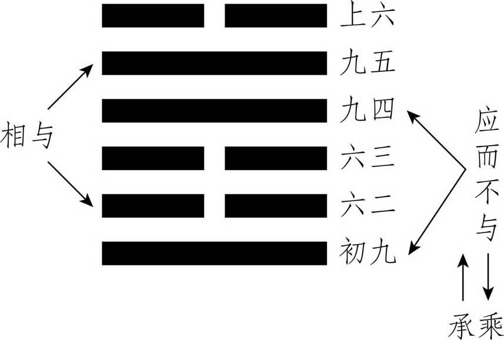
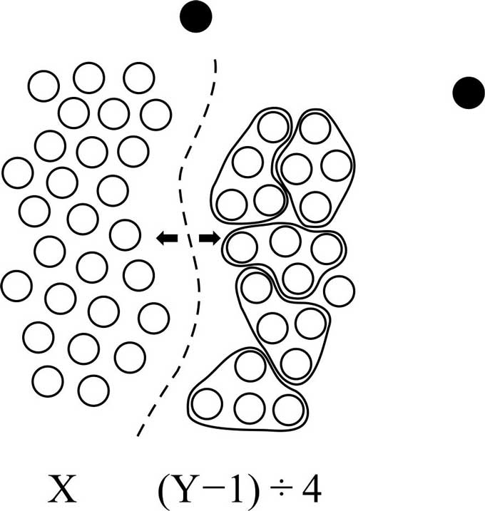

## 导论

　　《易经》有一套由六十四卦、三百八十四爻的符号所构筑的象征体系，以爻与爻、爻与卦、卦与卦间种种错综复杂的关系来描述宇宙人生的变化。为了便于读者清晰掌握本书的分析架构，有必要将卦、爻象的基本含义作一番说明。
　　
　　
　　
　　卦代表宏观的情境，爻则为其中不同层次、不同立场的更细微的变化。以组织结构而论，卦代表全体，爻则代表从基层到高层的六个位阶（如图）。初爻、二爻和三爻合组成下卦，为代表民间或地方政府的被管理阶层；四爻、五爻和上爻合组成上卦，为中央政府的决策管理阶层。上卦和下卦间的互动，即表示朝野的关系良窳，足以决定全卦的吉凶祸福。五爻为君位，独掌大权，领袖群伦；四爻为近臣或重臣之位，辅佐五爻治理天下，伴君如伴虎，角色很难扮演；上爻为半退休的老臣之位，有时也代表全卦的最高精神象征。
　　
　　爻除了象征地位外，也代表时序的变迁。初至三爻为从始到终的一个周期，四至上爻为终而复始的又一个周期。第一个周期的特性即由下卦、亦称内卦来表征，次一周期则由上卦、亦称外卦而显示。
　　
　　三画卦的八卦有其基本特性：乾（☰）健，精进不息；坤（☷）顺，和顺包容；震（☳）动，积极主动；巽（☴）入，婉转深入；坎（☵）陷，险恶陷溺；离（☲）丽，相续附着；艮（☶）止，适可而止；兑（☱）悦，衷心喜悦。至于乾为天、坤为地、震为雷、巽为风、坎为水、离为火、艮为山、兑为泽，则为自然界的八种取象，只要合于前述的基本特性，八卦可作无穷无尽的取象。
　　
　　八卦相荡，上下内外互动的结果，自然产生六十四卦的种种情境。例如豫卦，上卦震动、下卦坤顺，表示决策高层积极主动、组织基层顺从配合，故有卦辞所云“利建侯行师”之象。又如丰卦，内卦离为火为明、外卦震动，表示先明而后动，真知力行的结果，当然大有斩获。
　　
　　爻分阴阳，卦中初、三、五的奇数位为“阳位”，二、四、上的偶数位为“阴位”，阳爻居阳位或阴爻居阴位，称为“当位”，反之则为“不当位”。以人事安排论，当位即称职，量才适性，容易有好的表现。二爻居下卦之中，五爻居上卦之中，分别代表民间意见领袖及政府领导人的位置，不论当不当位，已经占了优势，这称为“得中”。当位又称“正”，“中”大于“正”，若“九五”、“六二”则既中且正，本身条件好到极点。
　　
　　一卦中爻际的互动关系也很重要。相邻两爻间的关系为“承乘”，下承上、上乘下，组织内长官和部属的辖隶关系即属此。“阴承阳”，亦称“柔承刚”，实力弱的接受实力强的领导，正常而多吉；“阴乘阳”，外行领导内行，官大学问大，反常易获凶。“阴乘阳”、“柔乘刚”，也象征欲望蒙蔽了理智，正义不得伸张，当事者容易做错事情。
　　
　　初爻和四爻、二与五、三与上，相隔三爻间的关系为“应与”，代表组织上下内外的呼应关系。相应两爻若为一阴一阳，资源互补，配合无间，称为“相与”；若同为阴或阳，合作关系较差，称“应而不与”（如下图所示）。人处任何环境，远近亲疏、承乘应与的关系特别重要，非搞清楚不可。
　　
　　
　　
　　卦所代表的宏观情境亦非孤立，而与其他卦之间有或深或浅、或隐或显的关系。最常见也最密切的一种，称为“相综”，以卦画论，六爻依上下次序颠倒旋转一百八十度，所成卦象即为原卦的综卦。例如师卦和比卦相综（如下图所示），正面看为“师”，反面看为“比”，“师”是军事战斗，“比”是外交结盟，二者实为一体两面、同时俱生，可交相为用。外交需以武力为后盾，团体与团体间往往既联合又斗争。综卦的好处在教导人全方位看问题，设身处地了解对立者的观点，进而寻求辩证式的更高层次的综合。
　　
　　
　　
　　一卦六爻阴阳全变，所得之卦为原卦的“错卦”，代表一种彻底的剧烈变化。例如蒙卦和革卦相错（如下图所示），启蒙成功、民智全开即为革命。错卦亦称“旁通卦”，性质截然相反的事物，一样有建立共识、相资相成的可能。例如乾、坤相错，坎、离相错，天地合而生万物，水火合成既济等。
　　
　　
　　
　　六十四卦非任意排列，有其自然演进的顺序，称为卦序。了解卦序，对事情发展的来龙去脉、前因后果即能掌握，看问题不但有历史的纵深，还可对未来有精确的预估。综卦既为一体两面、同时俱生，在卦序中当然排在一起；错卦表示剧烈的变化，在一个时代伊始和快结束之时也会并排出现。例如乾一、坤二，开天辟地就是错卦的大变动，既济六十三、未济六十四，宇宙绵绵无绝期。《易》分上、下经，上经三十卦，下经三十四卦，象征偏重天道或人事的两重演化。上经快结束前，颐二十七、大过二十八、坎二十九、离三十，为起伏极大的相错巨变；下经也是全经最后，中孚六十一、小过六十二，动荡之烈，令人很难适应。今日全球瞩目的金融风暴，政经格局变动之大，即印证了错卦之理。
　　
　　积爻成卦，爻变，卦也可能跟着变，风云人物往往开创机运，扭转时代。例如困卦“九五”爻变，成解卦（如图），表示君子固穷，遭困不改常度，终于脱困；否卦“九五”爻变，成晋卦（如图），上下不交的局面得以重见光明。除了一爻变外，也有二至五爻变的情形，孰为主变数？孰为次要变数？抑或大家联合起来一起变？或者格于时势，想变而变不成？总之，个体和群体间的相互制约与连动，非常精微而复杂，足供我们深论世事之时参考。
　　
　　
　　
　　最后是“中爻”，也就是所谓卦中卦的理论。中爻指居全卦中间的三、四两爻，为天、地、人三才中的“人位”，承上启下、继往开来，多凶、多惧、多是非。此二爻与上下诸爻联结，重新排列组合，会产生新的卦，潜伏在原卦内而发挥无形的影响力。例如泰卦，以三、四、五爻合成上卦震，二、三、四爻合成下卦兑，配成雷泽归妹（如图），归妹卦即为泰卦的卦中卦；同理，否卦的卦中卦为渐卦（如图）。人生持盈保泰不易，骄奢致败，即受了归妹卦“柔乘刚，无攸利”的影响；而解消否境，往往漫漫难熬，也和“否”中之“渐”有关。
　　
　　
　　
　　此外，三至上、初至四、二至上、初至五，亦可合成另四组卦中卦，都对本卦及相关爻位产生影响。人生实无孤离情境，一切息息相关啊！
　　
　　《易经》狭义来说，系指卦爻辞，通共才四千多字；广义来说，则包括号称“十翼”的十篇传文在内，使其篇幅达到两万多字。《彖传》、《象传》依经分为上下篇。《彖传》解释卦辞、分析全卦结构、指出主力爻的地位，而且往往有崭新的创见。《象传》又分《大象传》和《小象传》，前者偏重上下卦的互动关系，将自然界的道理落实到人间世来施行；后者解释爻辞，依当位居中、承乘应与的法则剖析吉凶。
　　
　　《系辞传》通论《易经》，分上下篇，共二十四章，哲理意境极高。《文言传》专释乾坤两卦，教人从基本面进德修业之略。此二传内文多称“子曰”，和孔子思想有密切关系。
　　
　　《说卦传》探索作卦的缘由，阐论八卦的特性、方位及彼此互动的情状。《序卦传》解析卦序之理；《杂卦传》另出机杼，将原有卦序打乱，以一、二字对比显示错综诸卦之理，混沌中自有秩序，堪称“十翼”中压轴盖顶之作。
　　
　　《杂卦传》最末言：“夬，决也，刚决柔也。君子道长，小人道忧也。”《易》为君子谋，天道悠悠无尽，人道庄敬自强，今日时习论《易》，也无非就是这种心情吧！

## 占卜玄机

　　占卜之学是《易经》里很特殊，也极富魅力的领域，一般人对《易经》的印象，往往与之有关。易学中一向有义理与术数的分途，阐扬义理固为儒林正宗，占卜术数能风行华夏数千年，也必有其难以磨灭的价值。
　　
　　我自己学《易》近四十年，对占卜本来是存而不论，虽知晓筮法大要，一直也未曾深究。二十多年前，因事业上遭遇极复杂难解的问题，心血来潮，破例开占。本以为断几卦便可歇手，不想事态发展出人意料，竟陆续占了数百卦，还未见了局。世道艰险固然深有体会，误打误撞，困知勉行，对占卜之学倒也颇窥门径。后来因授《易》讲学的需要，即占即悟，体会更深，竟走出了一条前所未有的新路。
　　
　　一般我们说“卜筮”，“卜”是用龟甲或兽骨，以火灼烧，视其自然显现的裂纹（即所谓兆）而定吉凶；“筮”则是用竹签或蓍草，共五十根，透过一定程序的分合演算，得出六爻卦象，再根据卦理判断吉凶。龟卜之术应已失传，筮法虽有争议，一直流传至今。
　　
　　蓍草难寻，一般都是用代用品，竹签、木棍甚至围棋子，只要规格化有五十数就可以拿来占筮，我自己用的多年前定做的五十根、一尺长的钢条，因为沉重，摆在家中，出外旅行另备短得多的竹签，就是烤肉用的那种，超市都买得到。还有些场合，什么也没带，临时起意，就用瓜子壳或牙签凑数，在觥筹交错、歌酒尽欢的喧嚷里，凝神试占，倒也没有不准过。可见规格化云云，或者什么烦琐的“筮仪”，熏香沐浴、斗室孤灯之类，都不是最重要的条件。真正的“决策”关键，还在苦思求解的诚意，即所谓“至诚如神”，精诚所至，才能感应金石为开。这是卜筮之魂，也是易象易理的发轫点。
　　
　　往下我们直接介绍筮法——大衍之术。《系辞上传》第九章专述筮法：

　　大衍之数五十，其用四十有九。分而为二以象两，挂一以象三，揲**shé**之以四以象四时，归奇**jī**于扐**lè**以象闰，五岁再闰，故再扐而后挂。乾之策二百一十有六，坤之策百四十有四，凡三百有六十，当期之日。二篇之策，万有一千五百二十，当万物之数也。是故四营而成易，十有八变而成卦。八卦而小成，引而伸之，触类而长之，天下之能事毕矣。显道神德行，是故可与酬酢，可与佑神矣。子曰：“知变化之道者，其知神之所为乎。”

　　 “衍”是推演、演化、演变之意，筮法是以蓍草来模拟天地万物创生演化的过程。要做好完整的模拟演化（大衍），须准备五十根蓍**shī**草，占筮时抽出一根不用，只用四十九根。这就是“大衍之数五十，其用四十有九”。不用的那根象征太极，是万物创生的本体，以不变应万变。
　　
　　将四十九策（一根蓍草或竹签叫一策，我们所谓决策、计策、策略都由此而来，决策就是以策决疑）任意分为左右两部分，这就是“分而为二以象两”，象征太极生两仪，有了天地阴阳、男女对待。这个一分为二的动作极为重要，直接决定了往下每一变的发展，成一个卦要历经十八变，这个动作也就重复十八次。左右策数各多少，完全随机与偶然，无法事先确定。巴比伦秘传的高级占星术，用扑克牌占运，也有类似的操作（切牌），天下之理应有互通。
　　
　　将右半边的部分挂其一策，这就是“挂一以象三”，所挂之策与前面分化的两部分，合而为三，象征天、地、人三才。
　　
　　将该部分“挂一”后剩下来的策数，每四个四个一数，这就是“揲之以四以象四时”，用来象征一年四季春夏秋冬。“揲”音“舌”，就是数的意思。
　　
　　数到最后，会有余数，就像除法一样。不同的是若整除，不是余数为零，而是余数为四。换句话说，剩余的策数可能为一、二、三或四。将余策取而夹之指间，这就是“归奇于扐以象闰”。“奇”就是余数，“扐”是手指之间，“闰”是闰年，每四年闰一次，即大家熟知的一年三百六十五又四分之一日，零头凑齐在闰年为三百六十六日，阳历上是2月29日。
　　
　　这时再取原先分二后搁置的左边另一部分，也是四个、四个一数（注意：这时不需再“挂一”，直接“揲之以四”），数到最后，剩余策数当然也是一、二、三或四，将余策取而夹之指间。
　　
　　最后将指间所夹的两次余策取出，与原先“挂一”之策放在一起，这就是“五岁再闰，故再扐而后挂”。一闰之后，第五年又闰，所以须将另一部分也“揲四”、“归奇于扐”，如法炮制一番。完成后再将扐之余策挂置。
　　
　　以上才完成一变，一个模拟天、地、人、时的循环。其结果有两种：除掉“挂一”跟再挂的余策外，还剩四十四策或四十策——亦即再持的余策总和为“四”或“八”。因四十九根“挂一”后剩四十八根，是“四”的倍数，分而为二后各以“四”除，余数的和当然非四即八，这是数理的必然。前面说分二是随机与偶然，往下的“挂一”、“揲四”、“归奇”，以及再“揲四”、再“归奇”而后挂，则是偶然后的必然发展。万事万物的创化过程确实如此，许多突破性的创造发明是无中生有，很偶然很随机，并无定法可循，而创生后依法推演就容易得多了。
　　
　　往下再将一变所剩的策合在一起（总数为四十四或者四十），依上例推演。经分二、挂一揲四、归奇、再揲四、再归奇而后挂等操作，完成二变，其结果有三种：还剩四十或三十六或三十二策。
　　
　　然后再将二变所剩之策合在一起（四十或是三十六或是三十二），依例推演，完成三变其结果有四种：还剩三十六或三十二或二十八或二十四策，这就代表四个四个一数的总次数为九或八或七或六。“九”为老阳，是可变的阳爻；“八”为少阴，是不变的阴爻；“七”为少阳，是不变的阳爻；“六”为老阴，是可变的阴爻。
　　
　　至此初爻成，所谓“三变成一爻”。阳爻画“”，如为老阳，记一“九”字于画旁；如为少阳，则记一“七”字于画旁。阴爻画“”，如为老阴，记一“六”字于画旁；如为少阴，则记一“八”字于画旁。
　　
　　二、三、四、五、上各爻皆依初爻的演法得出，六爻得出，卦即完成。一卦六爻，每爻三变，所以十八变而成一卦，这就是“十有八变而成卦”。
　　
　　至于“四营而成易”，有两种说法：一是“易”作“变”解，“营”是经营、操作，“四营”就是“分二”、“挂一”、“揲四”、“归奇”四项单元操作，十八变中每一变都是这样操演而成。一是“四营”即指六、七、八、九四个数，七、九奇数为阳，六、八偶数为阴，所谓“天一地二，天三地四，天五地六，天七地八，天九地十”，占了其中四个。依筮法操作，不论“分二”的歧异有多大，三变的最后结果，一定不出这四个数。
　　
　　“四营”又象征一年四季，“七”象春，是少阳，阳气渐壮；“九”象夏，是老阳，气温升高阳气已至成熟巅峰；“八”象秋，是少阴，由老阳阳极变阴而成，气温逐渐下降；“六”象冬是老阴，气温更低，寒气更重。明年阴极转阳，气温回升，又将变成“七”的少阳。
　　
　　由“七”到“九”、由“八”到“六”是阳气、阴气本身由弱转强的发展，属于量变，所以“七”为不变的阳爻，“八”为不变的阴爻。由“九”变“八”、由“六”变“七”则是阳极生阴、阴极生阳的质变，所以“九”为可变的阳爻，“六”为可变的阴爻。《易》卦六爻以九、六代称，而不称七、八，一则表示《易经》重视变，二则断卦须以爻辞为占时，该爻已生变动，往下很快会讲到。
　　
　　“四营”数字的长消循环，与四时气温的长消循环、植物生命的长消循环相配合，并非随意安排，这是易理致密之处。
　　
　　以上成卦之法写来繁复，一时似乎难以掌握。其实一回生二回熟，操演熟悉以后，根本非常简单。所谓“演卦容易断卦难”，真正难是难在断卦，精研一辈子，也未必能百发百中，演卦则小学生都能依式推演。多年前我初试占法时，为了怕错，亦步亦趋，照本施为，成卦完毕，花了快一小时。尔后日渐熟练，十几分钟也能占决完而有所会心。值得一提的，筮法中规定“挂一”、“归奇”须夹于指间，实际操作上可能不大方便，若占具是棋子或瓜子壳，也无从夹起，这些都不必拘泥，仅置于桌面上即可。为了便于大家了解，下面还是以围棋子做占具图解的方式辅助说明。

> （1）50枚围棋，拈出一枚不用。
>
> 　　
>
> （2）49枚任意分为X、Y两部分。
>
> 　　
>
> （3）Y部分抽出1枚，置于桌面。
>
> 　　
>
> （4）（Y-1）部分4个4个一数。
>
> 　　
>
> （5）余数可能为1、2、3、4，假定为1。
>
> 　　
>
> （6）再取X部分4个4个一数。
>
> 　　
>
> （7）余数在此例中，必为3，此即完成一变。将剩下的棋子再合并到一起，在此例中，总枚数为49-1-1-3=44。
>
> 　　
>
> （8）以合并后的44枚开始进行二变，重新组合。
>
> 　　
>
> （9）44枚任意分为X<small>1</small>、Y<small>1</small>两部分。
>
> 　　
>
> （10）Y<small>1</small>部分抽出一枚，置于桌面。
>
> 　　
>
> （11）（Y<small>1</small>-1）部分4个4个一数。
>
> 　　
>
> （12）余数可能为1、2、3、4，假设为3。
>
> 　　
>
> （13）再取X<small>1</small>部分4个4个一数。
>
> 　　
>
> （14）余数在此例中，必为4，此即完成二变，将剩下的棋子再合并到一起，此例中，总枚数为44-1-3-4=36。
>
> 　　
>
> （15）以合并后的36枚，开始进行三变。往后即依前例操作，再分X<small>2</small>、Y<small>2</small>两部分，（Y<small>2</small>-1）部分4个4个一数，余数可能为1、2、3、4，假设为4。X<small>2</small>部分4个4个一数，余数在此例中，必为3，而完成三变，此例，余数为36-1-4-3=28。
>
> 　　
>
> （16）此为三变完成图。28÷4=7，表示初爻为七，为不变的阳爻。
>
> 　　
>
> 图例得出初爻为不变的阳爻，在爻画旁注以“七”字。往下循同样步骤可演出二爻（虚一不用，象征太极的那一枚，在全部演卦过程中不可再动），若如下图所示，则余枚必为32。亦即“揲四”之数共8组，即二爻为少阴——不变的阴爻，在爻画旁注以“八”字。
>
> 　　
>
> 往下循环反复操作，可得出三、四、五、上各爻，假定都是七、七、八、八，即表示所有爻均无质变的可能，亦即所得出“之卦”不变，按筮法须以卦辞来占。例如成卦如下：
>
> 　　

　　明夷卦的《卦辞》只有三个字：“利艰贞。”这个卦我在二十多年前事业压力极大时占到，一看是不变的明夷卦，不觉苦笑。往后也时有出现，都是在身心境况极苦、周遭情势十分恶劣的关口。“如人饮水，冷暖自知”。几年下来，对明夷一卦的体会格外亲切。《易经》中有许多险卦、苦卦，而明夷卦是最艰难困苦的。“明”是有智慧、有本事能发光照亮世界，“夷”是受伤。“明夷”就是英雄末路，好人受苦，而且可能是长期受苦，三两下绝难脱困。“利艰贞”，就是教你做好承受大难的心理准备，在最艰困的环境下，仍得固守最重要的原则。八年抗战时，有人占国运，就碰到这卦。人道惊险，世路崎岖，多参悟这些处逆境的道理，总有补益。占筮时，并无其他规定或秘诀，只须专心存想要问的问题。为免干扰，一般多选较幽静的场合。

　　前例是不变的明夷卦，六爻非“七”即“八”，实占时也可能碰到“九”、“六”的可变之爻，例如下面的完成图：

　　

　　卦中出现可变之爻，复杂性大增，往下我们进入变卦法的讨论。

## 断占总论

　　以大衍之数的占法算出本卦后，若出现老阳“九”、老阴“六”的可变之爻，而且变爻不止一个，当如何判断卦的走势，又以哪个变爻的爻辞为准呢？
　　
　　朱熹在《易学启蒙》一书中，“明蓍策”、“考变占”等篇提出的说法，不知根据何在？变爻多至四五个时，以之卦不变爻占断，更违反了占“九”、“六”动爻、不占“七”、“八”静爻的基本规律，既繁复又说不出个道理，实难依从。
　　
　　日人高岛吞象所著《高岛易断》一书，所谓活解活断800例，最后皆以某卦卦辞或某爻爻辞论断，并未交代占算过程，是否依朱子之法不可得知。一卦中多爻变很常见，至少在四成六以上，可参阅本书附录邱云斌所撰《变卦！变卦！》一文，是否能简化为以其中一爻为主？揆诸常理，颇可商榷。
　　
　　我习《易》近四十年，翻看了古今好多论述，再以自己上万占的实际经验印证，觉得还是以现代学者高亨的说法最可信。他在《周易古经通说》末篇“周易筮法新考”里，提出一个“宜变之爻”的概念——可变之爻那么多，哪一爻应该变呢？他推敲《系辞上传》第九章的文字：“天一地二，天三地四，天五地六，天七地八，天九地十。天数五，地数五，五位相得而各有合。天数二十有五，地数三十，凡天地之数五十有五，此所以成变化而行鬼神也。”分析必有所谓，在行文脉络上与筮法密切相关。天数为奇，地数为偶，五个奇数相加为二十五，五个偶数相加为三十，总和为五十五。这么简单的算数，连小孩都会，何必在此郑重说明？
　　
　　“此所以成变化而行鬼神也！”天地之数的五十五，就是要用来决定卦的变化。占出爻的结果不出六、七、八、九四个数，称为四营，将一卦六爻的营数相加，可得出卦之营数，最小为三十六（六爻皆“六”），最大为五十四（六爻皆“九”）。营数的极限比五十五还少一，相当耐人寻味，让人想起虚一不用、象征太极的那根蓍草。人怎么费心经营，也超越不了天地的定数，千算万算，不抵老天自然一算啊！
　　
　　**高亨认为欲定变卦，须以“卦之营数”与“爻之序数”凑足天地之数，方法是以五十五减去卦之营数，所得余数可能为一到十九。自初爻往上数，数至上爻，再自上爻往下数，数至初爻，复自初爻往上数，如此循环往复，直到余数尽了为止，所止之爻位即为“宜变之爻”。**
　　
　　筮时所得卦，称为“本卦”，因爻变所成的卦，称为“之卦”或“变卦”。“之”即至、到、变成之意。本卦也称“贞卦”，之卦也称“悔卦”，三爻齐变时即有“贞悔相争”的相持不下的情形。一般就本卦论，下卦即内卦称“贞”，上卦即外卦称“悔”。筮法上有“贞我悔彼”之说，以内卦代表问占者本身，外卦代表对手或对象，但亦不可一概而论。总之，由“贞”到“悔”，代表事势变动发展的方向。
　　
　　为了说明方便，往下将所有筮占可能出现的类型，依上述断占原则，举例阐析之。
　　
　　**（1）六爻皆不变**
　　
　　本卦六爻皆为“七”或“八”，所有爻都没有变动的意向，全卦当然安静不变，根本用不上天地之数的计算，**直接以本卦的卦辞卦象占断**即可。
　　
　　**（2）六爻全变**
　　
　　本卦六爻皆为九或六，等于是组织中所有成员全票通过改变现状，**以六爻全变（阳爻变阴爻，阴爻变阳爻）所成“之卦”的卦辞卦象为主断占**。当然，这与直接占到不变的之卦不同，还需**考虑由本卦剧变成之卦的情由**。由于变量太多，宜变之爻已无意义，也不必再用天地之数的方法去计算。
　　
　　**六爻全变之本卦若为乾、坤**，又有不同考虑。依高亨的说法，占到六个“九”的六爻全动的**乾卦，主要以“用九”“见群龙无首，吉”断占**，而非用坤卦卦辞；占到六个“六”的六爻全动的**坤卦，主要以“用六”“利永贞”断占**，而非用乾卦卦辞。此解于《左传》有据，虽然后世争议甚多，我看还是有道理的。其实占到六爻全变之卦的几率甚低，约略大于五千分之一，占到六爻全变的坤卦更是稀罕之至，为16777216分之一，亦即4096乘4096分之一，相当于同一问题连占三次，均得出同一卦象，**没有特殊机缘是碰不到的**。
　　
　　**（3）一爻变**
　　
　　除六爻全不变与全变的情况之外，其他一爻到五爻变的情形，都得先求其宜变之爻。宜变之爻若为九（老阳），则变为八（少阴），若为六（老阴），则变为七（少阳），要参考本卦变爻的爻辞断占。三爻至五爻变，表示过半数想变，局势很不稳定，需考虑多爻齐变的情况，二爻变以上，何者为主变量？何者为次要变数？亦须仔细斟酌。往下还是列举各种状况，举占例以详细说明之。
　　
　　一爻变的情形中，**若此爻正好值宜变的爻位**，则阳变阴或阴变阳，而得出“之卦”，主要**以本卦变爻爻辞断占**，同时亦可**思考由本卦变成之卦的情由**。
　　
　　一爻变的情况，**若该爻并不值宜变爻位**，则可**以本卦卦辞卦象断占**，也还是须**重视该爻爻辞所示的变动意向**，并**参考一旦变为之卦后的可能发展**。
　　
　　**（4）二爻变**
　　
　　本卦若有二爻为九或六，**如其中一爻恰值宜变之位**，表示该爻为主变量，**以其爻辞为主断占**，**另一爻为**次要变量，亦列为**参考**。**宜变之爻爻变所得之卦象，以及两爻齐变所成之卦象，与本卦之间的因果关联**，亦应用心思考。
　　
　　二爻变的情况中，**若两爻均非宜变之爻**，仍**以本卦卦辞卦象断占**，因卦中可变之爻少于不变之爻，大局尚可维持稳定。**两爻欲变而未成，其意向仍宜列入观察考虑，二爻爻辞及两爻齐变所含之卦象，亦多注意。**
　　
　　**（5）三爻变**
　　
　　本卦若有三爻为九或六，**如其中一爻恰值宜变爻位**，为主变数，**以该爻爻辞为主断占**，亦**参考单爻变所成之卦的卦象卦辞**。由于六爻中变量已达一半，本卦呈现不稳定，亦需**考虑三爻齐变所成之卦的卦象卦辞**。
　　
　　三爻变的情形中，**若三爻皆非宜变之爻**，则变九为八、变六为七，而**得三爻齐变的之卦**，主要**以本卦和之卦的卦辞卦象合参断占**。因为卦中可变之爻与不变之爻相等，称为**“贞悔相争”**，就像拔河一样，相持不下。本卦即“贞卦”，稳定不动；之卦即“悔卦”，产生变动。究竟如何，**情势相当微妙**。
　　
　　**（6）四爻变**
　　
　　本卦若有四爻为九或六，因可变之爻已过半，局势往四爻齐变的之卦倾斜，主要**以之卦的卦辞卦象断占，思考由本卦变成之卦的缘由**。四个变爻其中**一爻若值宜变之位**，为主变量，影响较大，亦**加重考虑其爻辞**，以助占断。若**四爻皆不值宜变之位**，即**以四爻齐变所成之卦的卦辞卦象论断**吉凶。
　　
　　**（7）五爻变**
　　
　　本卦如有五爻为九或六，已接近全部变动，本卦很难维持稳定，径**以五爻齐变所成之卦的卦辞卦象为主断占**。若**其中一爻恰值宜变之位**，其爻辞较具影响力，稍**加重考虑**，并**思考由本卦变至之卦的缘由**。
　　
　　**以人事来推，学者高亨这一套相当合理。宜变之爻位是一种客观的规定，可变之爻是主观的潜能，二者相值，意谓环境允许有能力者尽情发挥，自然就按照可变之爻辞的意向变化。二者不相值，表示环境限制有想法、有能力的人变动，这种人若居少数，整个社会组织尚可维持稳定；若居多数，则不管许不许变、宜不宜变，思变的人心会自行串联而掀起巨变。三爻变以上，需考虑多爻齐变后的之卦卦辞、卦象，就是这个道理。高亨这套变卦法，确有精义，而且可以之破解《左传》、《国语》上流传甚久的筮例，获致最圆满的说明，这可算是他在易学上难得的贡献。**
　　
　　前述各种类型须参考卦辞卦象、或爻辞爻象断占，除了文辞之外，还得深入观察卦象爻象，善体言外之意，才能断得精准。因为“辞生于象”、“象生于意”，得象忘言，得意忘象，尽量掌握占象中所蕴含的丰富信息，断卦才有境界，而不只是机械呆板的吉凶输赢而已。演卦容易断卦难，说到头还是得精通义理，对卦名、卦序，以及卦与卦间、爻与爻间各种错综复杂的关系，都有深刻认识才好。另外，人生的实务历练也很重要，《易经》的智慧来自生命生活的深度观察与体验，习《易》者也得以自身的生命生活去印证，方能透悟。
　　
　　再者，易占并非宿命论，卦爻辞中通常都有但书（即条件)，当事者须能做到才会有好结果，这就涉及德性与智慧的培养与练达。宋儒张载有句名言：“易为君子谋，不为小人谋。”所谓“占者有是德，方应是占”，这都不是道德劝说，而是真懂《易》道的经验之谈。我学《易》授《易》数十年，常提“借占习易，借易修行”，愿与天下仁人君子共勉之。
　　
　　问占时起心动念，越专注越好，设计问题宜单一明确，太复杂庞大的问题，可以分成几个相关的子题来分次起问，或串联或并联，再综合起来，下整体而全方位的判断。举例来说，我每年初固定会算台湾运势，通常划分为政、经与两岸关系三方面，算内地运势，再加上中美关系这个重要项目。这是横向平行关系的并联问占，像解联立方程式一般，去掌握整体的情势。纵向的串联问占属追问性，逐次搞清楚环环相扣的小问题，贯串起来，大问题即可迎刃而解。还有些复杂难解的问题，先得出的卦象犹有未明之处，可针对该处再问其详情，往往可得出聚焦放大倍率的清晰效果，如此两三次，其结构及内涵可彻底弄清楚。运用之妙，存乎一心，好学深思者，盍兴乎来！

 

（完）